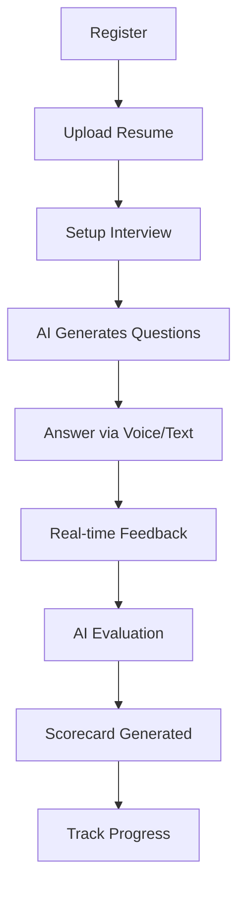

<h1 align="center">
  
</h1>

<p align="center">
  <b>AI-powered platform for mock interviews, real-time feedback & hiring intelligence</b>
</p>

---

<p align="center">
  
  
  
  
  
</p>

<p align="center">
  
  
</p>

---

<p align="center">
  <a href="#-demo">Demo</a> •
  <a href="#-features">Features</a> •
  <a href="#-workflow">Workflow</a> •
  <a href="#-tech-stack">Tech Stack</a> •
  <a href="#-setup">Setup</a>
</p>

---

## 🚀 Overview

PrepGenius is an **AI-powered interview preparation platform** that simulates real interview environments and delivers **real-time feedback, performance analytics, and recruiter-level insights**.

💡 Designed to bridge the gap between **practice and actual hiring decisions**.

---

## 🎥 Demo

<p align="center">
  
</p>

---

## ✨ Features

### 🎤 AI Interview Engine
- Personalized questions (Resume + JD)
- Adaptive difficulty (Easy → Medium → Hard)
- Real-time speech coaching using Socket.io
- Voice + text answer support

### 📊 AI Scorecard
- Technical score
- Communication score
- Confidence & clarity metrics
- Strengths & Improvements
- AI-generated summary

### 📄 Resume Intelligence
- PDF parsing (skills, projects, experience)
- ATS score (0–100)
- Optimized resume PDF download

### 📈 Progress Tracking
- Score trends over time
- Weak topic detection
- AI Memory (tracks past mistakes)
- Learning roadmap generator

### 🤖 AI Coach
- Real-time feedback tips
- Multi-round question generator
- Memory-based interviews (RAG)
- Personalized learning roadmap

### 🧑‍⚖️ Recruiter Dashboard
- Candidate analysis (YES / NO / MAYBE)
- AI-generated hiring summary
- Candidate ranking system

---

## 🔄 Workflow

### 👤 Candidate Journey


## 🏗️ Tech Stack

| Layer      | Technology                  |
|-----------|----------------------------|
| Frontend  | React, Vite, Chart.js      |
| Backend   | Node.js, Express           |
| Database  | MongoDB                    |
| AI        | Google Gemini              |
| Realtime  | Socket.io                  |
| Editor    | Monaco Editor              |

---

## ⚙️ Setup

### 1️⃣ Clone the Repository
```bash
git clone https://github.com/your-username/prepgenius.git
cd prepgenius
2️⃣ Backend Setup
cd backend
cp .env.example .env
npm install
npm start
3️⃣ Frontend Setup
cd frontend
npm install
npm run dev
🌟 Why This Project Stands Out
🧠 Combines GenAI + Speech + Behavioral Analysis
🎯 Adaptive interview difficulty system
⚡ Real-time coaching using WebSockets
📊 Recruiter-level candidate ranking
🔁 AI Memory (tracks improvement over time)
